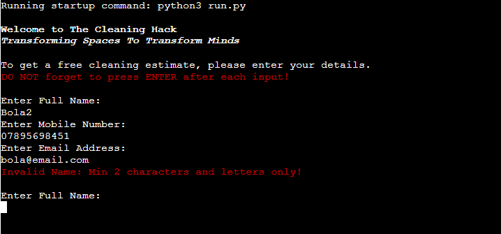
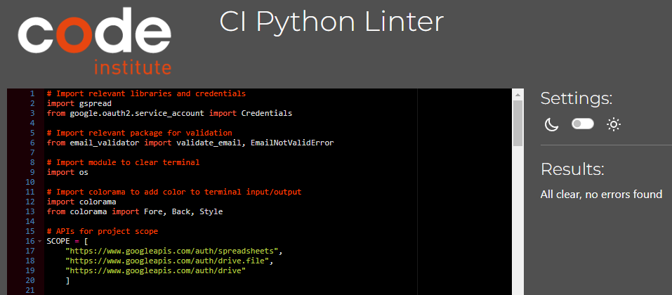

# The Cleaning Hack Calculator

## A Python command line calculator
> This application is a Python-based calculator for a real business, The Cleaning Hack. The application is used to produce a free cleaning estimate for potential clients. The application requires the user to enter their full name, mobile number and email address which is validated prior to prompting the user to enter the details required to produce an estimate i.e. number of bedrooms, bathrooms, living spaces and any other rooms. These details are also validated prior to them being uploaded to a Google Worksheet which the business owner will reference when initiating follow-up actions with the client.

#### Designed and Developed by Bola Akinmarin

### **[Live site](https://the-cleaning-hack-calculator-7f6b677fafbc.herokuapp.com/)**

### **[Repository](https://github.com/BAkinmarin/the-cleaning-hack-calculator)**

  
## Table of contents

 1. [ Pre-Project Planning ](#plan)  
 2. [ Features Left to Implement ](#left)  
 3. [ Technology used ](#tech) 
 4. [ Testing ](#testing)  
 5. [ Bugs ](#bugs)  
 6. [ Deployment](#deployment)
 7. [ Credits](#credits)
 8. [ Content](#content)  
 9. [ Acknowledgements](#acknowledgements)  

## Flow

### Pre-project Planning

> For my portfolio project 3, I wanted to address a real need hence my decision to create a cleaning estimate calculator for The Cleaning Hack, a real and active cleaning business. 

> After discussing with the business owner and identifying a gap in their internal processes, particularly in automating cleaning estimates and lead tracking, I was confident in my decision. 

> Using Lucid Chart, I created a flow diagram to help visualise the steps and logic needed to make the project design and execution as efficient as possible.

> See flow chart below for a visual of initial design and concept.

### Pre-Planning Structure

### Structure

#### User Details

- Full Name

- Mobile Number

- Email Address

This information, once captured, feeds into the business owner's lead generation and management system.

#### Property Details

- No. of Bedrooms

- No. of Bathrooms 

- No. of Living Areas i.e. Frontroom, Kitchen

- Other Rooms i.e. Conservatory, Utility

This information is valuable to the business owner as it helps predict the duration of a job so resources such as materials, equipment and labour can be allocated accordingly. 

## Program Flow
> When the user loads the program, they are presented with a welcome message and instructions on how to interact with the program.

> Simultaneaously, the user will be prompted to enter their full name, mobile number and email address, which will be validated before they can proceed to the next step. See below:

> If validation fails at this stage, the user will see the corresponding error message(s) based on the specific issue. The following images illustrate attempts to submit an alphanumeric name, an incorrect mobile number (fewer than 11 digits), and an incorrect email format. See below:

> If validation passes, the user will be prompted to provide the number of bedrooms, bathrooms, living areas / receptions and any other rooms. See below:

> If validation fails, the user will see an error message and then be prompted to re-enter information on number of bedrooms, bathrooms, living areas / receptions and any other rooms. See below:

> If validation is successful, the user will see a summary of their entry along with a cleaning estimate.

> Additionally, the user will be asked to enter "Y" if they would like to obtain a new estimate or any other key to exit the program. See below:

> If the user requests a new estimate, they will be again be prompted to provide number of bedrooms, bathrooms, living areas / receptions and any other rooms. See below:

> If the user chooses to exit the program, they will see an exit message as shown below:

### Features left to implement

- Functionality to prompt the user to re-enter only the specific data that fails validation.

- Functionality to accept only UK numbers as valid.

# Technology Used
### Python
Used to create the application.

### Heroku
Used to deploy and host the application.

### Github
Used to store the code.

### Gitpod
IDE used for creating the application.

### Git
Used for version control.

# Testing

### Testing Phase

#### Manual Testing

| Test | Result |
|--|--|
|On run program, the welcome message and instructions appear|Pass|
|After instructions, user is prompted for name|Pass|
|Once name is input user is prompted for mobile number|Pass|
|Once mobile number is input, user is prompted for email address|Pass|
|Feedback message shows with further instructions on how to enter property details|Pass|
|After instructions, user is prompted for no. of bedrooms|Pass|
|Once no. of bedrooms is input, user is prompted for no. of bathrooms|Pass|
|Once no. of bathrooms is input, user is prompted for no. of livingrooms|Pass|
|Once no. of livingrooms is input, user is prompted for other rooms|Pass|
|Once no. of other rooms is input, feedback message is displayed with estimate|Pass|
|User is then asked if they want to obtain another quote or exit program|Pass|
|If user selects obtain another quote, user is again prompted to enter new property details|Pass|
|Once new property details have been entered, user is provided with new estimate|Pass|
|If user selects exit program, user is shown exit message and program ends|Pass|

#### User testing

The following tests are on error handling throughout the project.
If the error handling works as expected it will be marked as pass.
If the error handling does not work as expected it will be marked as fail.

> Enter Name
Error Msg: Invalid Name: Must not be blank!
Error Msg: Invalid Name: Min 2 characters and letters only!
Error Msg: Invalid Name: {part} not accepted!

| Test | Result |
|--|--|
|User tried to enter a name of less than two characters|Pass|
|User tried to enter a hyphenated name|Fail|
|User tried to enter an empty string|Pass|
|User tried to enter a name with a space in it|Pass|
|User tried to enter an alphanumeric name|Pass|

> Enter Mobile Number
Error Msg: Invalid Number: Must be 11 digits. Please try again.

| Test | Result |
|--|--|
|User tried to enter a number less than 11 digits|Pass|
|User tried to enter a letter|Pass|
|User tried to enter an empty selection|Pass|
|User tried to enter a symbol|Pass|
|User tried to enter a special character|Pass|

> Enter Email Address
Error Msg: Various EmailNotValidError messages.

| Test | Result |
|--|--|
|User tried to enter email without @ symbol|Pass|
|User tried to enter email without domain|Pass|
|User tried to enter an empty string|Pass|
|User tried to enter email without preceeding name before @ symbol|Pass|
|User tried to enter a special character|Pass|

> Enter Property Details
Error Msg: Invalid Data: You entered 'x'. Enter only numbers OR "0" if not applicable.

| Test | Result |
|--|--|
|User tried to enter a letter|Pass|
|User tried to enter an empty string|Pass|
|User tried to enter a special character|Pass|
|User tried to enter a mix of letters and numbers|Pass|

### Pep8 Checker tool

> I used the Pep8 checker tool to validate my python code to ensure it was free from errors as shown here:

> To keep within the length of 79 characters per line, I had to do a lot of re-coding and restructuring.

## **Bugs**

### Feedback Message - Details Accepted
> Unable to get sequence of notification messages in email validation function working - program currently displays when user email is invalid but not when all details have been entered correctly. **Fixed**

### Validation - User Name Field
> Unable to get validation to stop users entering numbers into name field. **Fixed**
> Unable to get validation to accept spaces. **Fixed**
> Unable to get validation to accept hyphenated names.

### Validation - Property Details
> Unable to handle exceptions for special characters or alphabets in number of rooms fields. **Fixed**

## Deployment

> To deploy the project to Heroku, I followed the steps outlined below:

1. Prepare run.py file by adding a new line character ("\n") at the end of the text inside all input methods.

2. Create list of requirements necessary for program to run on heroku by typing "pip3 freeze > requirements.txt" into the command line.

3. Navigate to heroku.com and log in.

4. Click "New" to create a new App.

5. Assign name to application, choose region and Click 'Create New App'.

6. On the next page click on the 'Settings' tab to adjust settings.

7. Click on the 'Config Vars' button.

8. Supply a 'KEY' of "CREDS" and 'Value' of contents of creds.json file. Then click the 'Add' button.

9. Supply a 'KEY' of "PORT" and 'Value' of "8000". Then click the 'Add' button.

10. Add buildpacks to install future dependencies needed outside of the requirements file.

11. Select 'Python' then 'Node.js' and click 'Save' - **Make sure they are in this order.**

12. Navigate to the deploy section and choose deployment method. 

13. To connect with github select 'Github' and confirm.

14. Search for repository, select it and click 'Connect'.

15. To deploy, choose one of the following options: 

- Automatic deploys - meaning Heroku will rebuild the app everytime a new change is pushed.
  - For this option, choose the branch to deploy and click 'Enable automatic deploys'. 
  - This can be changed to manual deployment at a later stage.

- Manual deployment - which deploys current state of branch.

16. Click 'Deploy branch'.

17. Click 'Open App' to launch application.

## Credits

Multiple resources used to better understand the logic and flow of functions and capabilities of Python.

### [Stack Overflow](https://stackoverflow.com/questions/8022530/how-to-check-for-valid-email-address)
> Useful for learning how to validate email addresses.

### [PyPi](https://pypi.org/project/email-validator/)
> A robust email address syntax validation library installed for use with this project.

### [PyPi](https://pypi.org/project/colorama/)
> Useful for adding ANSI escape character sequences to add color to terminal text.

### [Medium](https://medium.com/hacktive-devs/gspread-automate-google-sheet-with-python-dc1fa7c65c21)
> Useful guide by Sogo Ogundowole on GSpread: Automate Google Sheet with Python. Helped broaden my understanding of GSpread methods and applications.

### [Finxter](https://blog.finxter.com/how-to-print-italic-text-in-python/)
> Useful guide for adding styles to text.

### [Stack Overflow](https://stackoverflow.com/questions/23294658/asking-the-user-for-input-until-they-give-a-valid-response)
> Useful for resolving name validation issues encountered when using try and except statements. Provided better understanding of various methods of name input validation using if-else statements.

## Content and Resources

### w3 schools
> Used to reference Python Structure and play around with code ideas prior to including them in my project.

### Code Institute
> Project created in line with course content and within project 3 scope.

### Stack Overflow
> Used to review my own code to ensure simplicity where possible, and to navigate complexity where unavoidable.

### Medium
> Online publishing platform with distraction-free access to insightful articles by other Software Developers on specific topics.

### Youtube
> One of the most accessible learning platforms with a global reach. Very useful in broadening my approach to coding, providing insights into coding concepts from different perspectives.

## Acknowledgements

### Alan Bushell
> My mentor who provided me with great feedback and guidance at the inception of this project, helping to keep at the forefront the requirements for a successful project.

### Code Community
> Other software developers who gave feedback on their experience whilst interacting with The cleaning Hack Calculator.

### Family
> Special thanks to my family for supporting with user testing and providing feedback on flow and experience.